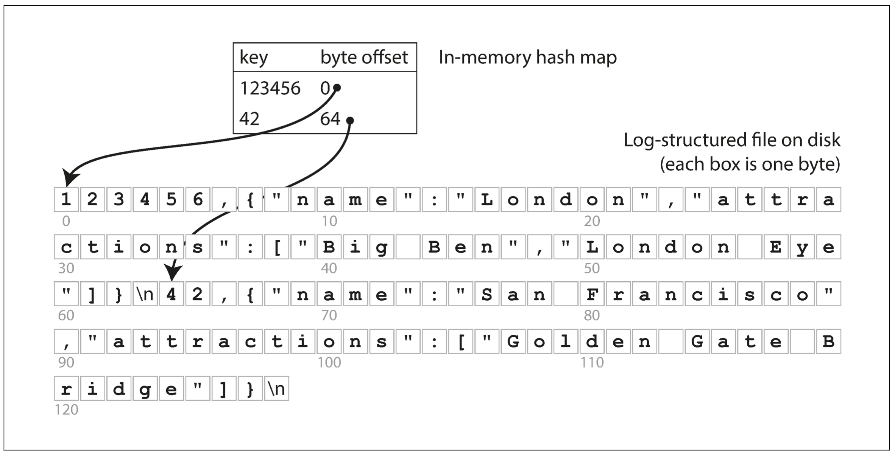

# Designing Data Intensive Applications

This document is essentially a summary of the book - "Designing Data Intensive Applications" by Martin Kleppmann. As I was reading through the book I jotted the important relevant points from the book in this document. Chapters from the book -
- **I. [Foundation of Data Systems](#part-i---foundation-of-data-systems)**   .117
  - [Reliable, Scalable and Maintainable Applications](#1-reliable-scalable-and-maintainable-applications-19) 19
  - [Data Models and Query Languages](#2-data-models-and-query-languages) 36
  - [Storage and Retrieval](#3-storage-and-retrieval) 34
  - [Encoding and Evolution](#4-encoding-and-evolution) 28
- **II. [Distributed Data](#part-ii---distributed-data)** 192
  - [Replication](#5-replication) 41
  - [Partitioning](#6-partitioning) 17
  - [Transactions](#7-transactions) 45
  - [Trouble with Distributed Systems](#8-trouble-with-distributed-systems) 37
  - [Consistency and Consensus](#9-consistency-and-consensus) 52
- **III. [Derived Data](#part-iii---derived-data)** 134
  - [Batch Processing](#10-batch-processing) 40
  - [Stream Processing](#11-stream-processing) 40
  - [Future of Data Systems](#12-future-of-data-systems) 54

<br>

[Top](#designing-data-intensive-applications)
## Part I - Foundation of Data Systems

### 1. Reliable, Scalable and Maintainable Applications

A data-intensive application is typically built from standard building blocks that provide commonly needed functionality. For example, many applications need to:
- Store data so that they, or another application, can find it again later (*databases*)
- Remember the result of an expensive operation, to speed up reads (*caches*)
- Allow users to search data by keyword or filter it in various ways (*search indexes*)
- Send a message to another process, to be handled asynchronously (*stream processing*)
- Periodically crunch a large amount of accumulated data (*batch processing*)

This book focusses primarily on 3 aspects -
- Reliability
- Scalability
- Maintainability

#### 1.1 Reliability 

Reliability means making systems work correctly, even when faults occur. Faults can be in hardware (typically random and uncorrelated), software (bugs are typically systematic and hard to deal with), and humans (who inevitably make mistakes from time to time). Fault-tolerance techniques can hide certain types of faults from the end user.

Types of faults -
  - Hardware Faults
  - Software Errors
  - Human errors

#### 1.2 Scalability

Scalability means having strategies for keeping performance good, even when load increases. In order to discuss scalability, we first need ways of describing load and performance quantitatively. We looked at Twitter’s home timelines as an example of describing load, and response time percentiles as a way of measuring performance. In a scalable system, you can add processing capacity in order to remain reliable under high load.

- ##### Describe Load
  
  Load can be described with a few numbers which we call load parameters. The best choice of parameters depends on the architecture of your system: it may be requests per second to a web server, the ratio of reads to writes in a database, the number of simultaneously active users in a chat room, the hit rate on a cache, or something else. 

- ##### Describe Performance
  
  When load increases there might be impacts to performance:
  - When you increase a load parameter and keep the system resources (CPU, memory, network bandwidth, etc.) unchanged, how is the performance of your system affected?
  - When you increase a load parameter, how much do you need to increase the resources if you want to keep performance unchanged?

    > **Latency and Response Time**
    > - *Latency* and *response time* are often used synonymously, but they are not the same.
    > - The *response time* is what the client sees: besides the actual time to process the request (the service time), it includes network delays and queueing delays.
    > - *Latency* is the duration that a request is waiting to be handled — during which it is latent, awaiting service 

    > **Measuring Response Times**
    > - *Mean* is not a very good metric if you want to know your “typical” response time, because it doesn’t tell you how many users actually experienced that delay.
    > - It is better to use *percentiles*. If you take your list of response times and sort it from fastest to slowest, then the median is the halfway point: for example, if your median response time is 200 ms, that means half your requests return in less than 200 ms, and half your requests take longer than that.

- ##### Coping with Load

  - People often talk of a dichotomy between ***scaling up*** (vertical scaling, moving to a more powerful machine) and ***scaling out*** (horizontal scaling, distributing the load across multiple smaller machines). In reality, good architectures usually involve a pragmatic mixture of approaches: for example, using several fairly powerful machines can still be simpler and cheaper than a large number of small virtual machines.
  - Some systems are ***elastic***, meaning that they can automatically add computing resources when they detect a load increase, whereas other systems are scaled manually (a human analyzes the capacity and decides to add more machines to the system). An elastic system can be useful if load is highly unpredictable, but manually scaled systems are simpler and may have fewer operational surprises.
  - Common wisdom until recently was to keep your database on a single node (scale up) until scaling cost or high-availability requirements forced us to make it distributed. As the tools and abstractions for distributed systems get better, this common wisdom may change, at least for some kinds of applications. It is conceivable that ***distributed data systems*** will become the default in the future, even for use cases that don’t handle large volumes of data or traffic.


The architecture of systems that operate at large scale is usually highly specific to the application—there is no such thing as a generic, one-size-fits-all scalable architecture (informally known as magic scaling sauce). The problem may be the volume of reads, the volume of writes, the volume of data to store, the complexity of the data, the response time requirements, the access patterns, or (usually) some mixture of all of these plus many more issues.

#### 1.3 Maintainability

Maintainability has many facets, but in essence it’s about making life better for the engineering and operations teams who need to work with the system. Good *abstractions* can help reduce complexity and make the system easier to modify and adapt for new use cases. Good *operability* means having good visibility into the system’s health, and having effective ways of managing it.

- ##### Operability: Making Life Easy for Operations
  Make it easy for operations teams to keep the system running smoothly. Good operations can often work around the limitations of bad (or incomplete) software, but good software cannot run reliably with bad operations.

- ##### Simplicity: Managing Complexity
  Make it easy for new engineers to understand the system, by removing as much complexity as possible from the system. Moseley and Marks define complexity as *accidental* if it is not inherent in the problem that the software solves (as seen by the users) but arises only from the implementation.
  One of the best tools we have for removing *accidental complexity* is **abstraction**. A good abstraction can hide a great deal of implementation detail behind a clean, simple-to-understand façade.

- ##### Evolvability: Making Change Easy
  Make it easy for engineers to make changes to the system in the future, adapting it for unanticipated use cases as requirements change. Also known as extensibility, modifiability, or plasticity. In terms of organizational processes, *Agile* working patterns provide a framework for adapting to change. The Agile community has also developed technical tools and patterns that are helpful when developing software in a frequently changing environment, such as *test-driven development (TDD) and refactoring*.

<br>

[Top](#designing-data-intensive-applications)

### 2. Data Models and Query Languages

Most applications are built by layering one data model on top of another. For each layer, the key question is: how is it represented in terms of the next-lower layer? For example:
1. As an application developer, you look at the real world (in which there are people, organizations, goods, actions, money flows, sensors, etc.) and model it in terms of objects or data structures, and APIs that manipulate those data structures. Those structures are often specific to your application.
2. When you want to store those data structures, you express them in terms of a general-purpose data model, such as JSON or XML documents, tables in a relational database, or a graph model.
3. The engineers who built your database software decided on a way of representing that JSON/XML/relational/graph data in terms of bytes in memory, on disk, or on a network. The representation may allow the data to be queried, searched, manipulated, and processed in various ways.
4. On yet lower levels, hardware engineers have figured out how to represent bytes in terms of electrical currents, pulses of light, magnetic fields, and more.

#### 2.1 Relational vs Document Model

- The roots of relational databases lie in *business data processing*, which was performed on mainframe computers in the 1960s and ’70s. The use cases appear mundane from today’s perspective: typically *transaction processing* (entering sales or banking transactions, airline reservations, stock-keeping in warehouses) and *batch processing* (customer invoicing, payroll, reporting).
- In the 2010s, **NoSQL** is the latest attempt to overthrow the relational model’s dominance. It has been retroactively reinterpreted as ***Not Only SQL***. There are several driving forces behind the adoption of NoSQL databases:
  -  A need for greater scalability than relational databases 
  -  A widespread preference for free and open source software 
  -  Specialized query operations that are not well supported by the relational model
  -  Frustration with the restrictiveness of relational schemas and desire for more dynamic and expressive data model

#### Object Relational Mismatch

- Most application development today is done in object-oriented programming languages, which leads to a common criticism of the SQL data model: if data is stored in relational tables, an awkward translation layer is required between the objects in the application code and the database model of tables, rows, and columns. The disconnect between the models is sometimes called an impedance mismatch.
- Object-relational mapping (ORM) frameworks like ActiveRecord and Hibernate reduce the amount of boilerplate code required for this translation layer, but they can’t completely hide the differences between the two models.

- ##### One-to-Many Relationship

  - Consider the below image. In the traditional SQL model, the most common normalized representation is to put `positions`, `education`, and `contact_info` in separate tables, with a foreign key reference to the `users` table
  - Later versions of the SQL standard added support for structured datatypes and XML data; this allowed multi-valued data to be stored within a single row, with support for querying and indexing inside those documents. These features are supported to varying degrees by Oracle, IBM DB2, MS SQL Server, and PostgreSQL.
  - A third option is to encode jobs, education, and contact info as a JSON or XML document, store it on a text column in the database, and let the application interpret its structure and content. In this setup, you typically cannot use the database to query for values inside that encoded column.
  

    

  - For a data structure like a résumé, which is mostly a self-contained document, a JSON representation can be quite appropriate. JSON has the appeal of being much simpler than XML. Document-oriented databases like MongoDB, RethinkDB, CouchDB, Espresso, etc support this data model.
  - The JSON representation has better *locality* than the multi-table schema. If you want to fetch a profile in the relational example, you need to either perform multiple queries (query each table by `user_id`) or perform a messy multiway join between the users table and its subordinate tables. In the JSON representation, all the relevant information is in one place, and one query is sufficient.

    ```json
    {
      "user_id": 251,
      "first_name": "Bill",
      "last_name": "Gates",
      "summary": "Co-chair of the Bill & Melinda Gates... Active blogger.", 
      "region_id": "us:91",
      "industry_id": 131,
      "photo_url": "/p/7/000/253/05b/308dd6e.jpg",
      "positions": [
        {
          "job_title": "Co-chair", 
          "organization": "Bill & Melinda Gates Foundation"
        }, 
        {
          "job_title": "Co-founder, Chairman", 
          "organization": "Microsoft"
        }
      ], 
      "education": [
        {
          "school_name": "Harvard University", 
          "start": 1973, 
          "end": 1975
        },
        {
          "school_name": "Lakeside School, Seattle", 
          "start": null, 
          "end": null
        } 
      ],
      "contact_info": {
        "blog": "http://thegatesnotes.com", 
        "twitter": "http://twitter.com/BillGates"
      } 
    }
    ```

  - The one-to-many relationships from the user profile to the user’s `positions`, `education` history, and `contact_info` imply a tree structure in the data, and the JSON representation makes this tree structure explicit.

- ##### Many-to-One and Many-to-Many Relationships

  In the preceding section, `region_id` and `industry_id` are given as IDs, not as plain-text strings "Greater Seattle Area" and "Philanthropy". Why? If the user interface has free-text fields for entering the region and the industry, it makes sense to store them as plain-text strings. But there are advantages to having standardized lists of geographic regions and industries, and letting users choose from a drop-down list or autocompleter:
  - Consistent style and spelling across profiles
  - Avoiding ambiguity (e.g., if there are several cities with the same name)
  - Ease of updating—the name is stored in only one place, so it is easy to update across the board if it ever needs to be changed
  - Localization support—when the site is translated into other languages, the standardized lists can be localized, so the region and industry can be displayed in the viewer’s language
  - Better search

  The advantage of using an ID is that because it has no meaning to humans, it never needs to change: the ID can remain the same, even if the information it identifies changes. Removing such duplication is the key idea behind normalization in databases.

  Unfortunately, normalizing this data requires many-to-one relationships, which don’t fit nicely into the document model. In relational databases, it’s normal to refer to rows in other tables by ID, because joins are easy. In document databases, joins are not needed for one-to-many tree structures, and support for joins is often weak. If the database itself does not support joins, you have to emulate a join in application code by making multiple queries to the database.

  Moreover, even if the initial version of an application fits well in a join-free document model, data has a tendency of becoming more interconnected as features are added to applications.

#### Are Document Databases Repeating History ?

- ##### Network Model

- ##### Relational Model


#### Relational Versus Document Databases Today

- ##### Which data model leads to simpler application code?

- ##### Schema flexibility in the document model

- ##### Data locality for queries

- ##### Convergence of document and relational databases


#### 2.2 Query Languages for Data

- When the relational model was introduced, it included a new way of querying data: **SQL** is a *declarative* query language, whereas IMS and CODASYL queried the database using *imperative* code.
- In a declarative query language, like SQL or relational algebra, you just specify the pattern of the data you want—what conditions the results must meet, and how you want the data to be transformed (e.g., sorted, grouped, and aggregated)—but not how to achieve that goal. It is up to the database system’s **query optimizer** to decide which indexes and which join methods to use, and in which order to execute various parts of the query.
- *Imperative code is very hard to parallelize* across multiple cores and multiple machines, because it specifies instructions that must be performed in a particular order. *Declarative languages have a better chance of getting faster in parallel execution* because they specify only the pattern of the results, not the algorithm that is used to determine the results. The database is free to use a parallel implementation of the query language, if appropriate 

#### Declarative Queries on the Web

  - In a web browser, using declarative CSS styling is much better than manipulating styles imperatively in JavaScript.

#### MapReduce Querying

  - MapReduce is *neither a declarative query language nor a fully imperative query API*, but somewhere in between: the logic of the query is expressed with snippets of code, which are called repeatedly by the processing framework. It is based on the **map** (also known as collect) and **reduce** (also known as fold or inject) functions that exist in many *functional programming* languages.
  - The map and reduce functions are somewhat restricted in what they are allowed to do. They must be **pure functions**, which means they only use the data that is passed to them as input, they cannot perform additional database queries, and they must not have any side effects. These restrictions allow the database to run the functions anywhere, in any order, and rerun them on failure.

#### 2.3 Graph Data Models

- A graph consists of two kinds of objects: **vertices** (also known as nodes or entities) and **edges** (also known as relationships or arcs).
- Graphs are not limited to homogeneous data: an equally powerful use of graphs is to provide a consistent way of storing completely different types of objects in a single datastore.
- There are several different, but related, ways of structuring and querying data in graphs. In this section we will discuss the **property graph model** (implemented by Neo4j, Titan, and InfiniteGraph) and the **triple-store model** (implemented by Datomic, AllegroGraph, and others). 
- We will also look at three declarative query languages for graphs: *Cypher*, *SPARQL*, and *Datalog*. Besides these, there are also imperative graph query languages such as *Gremlin* and graph processing frameworks like *Pregel*.

#### Property Graphs

#### Cypher Query Language

#### Graph Queries in SQL

#### Triple Store and SPARQL

  > Graph vs Network Model

- #### Datalog

#### Summary

- Historically, data started out being represented as one big tree (the hierarchical model), but that wasn’t good for representing many-to-many relationships, so the relational model was invented to solve that problem. More recently, developers found that some applications don’t fit well in the relational model either. New nonrelational “NoSQL” datastores have diverged in two main directions:
  1. Document databases target use cases where data comes in self-contained documents and relationships between one document and another are rare.
  2. Graph databases go in the opposite direction, targeting use cases where anything is potentially related to everything.

- One thing that document and graph databases have in common is that they typically don’t enforce a schema for the data they store, which can make it easier to adapt applications to changing requirements. 


<br>

[Top](#designing-data-intensive-applications)

### 3. Storage and Retrieval

#### 3.1 Data Structures That Power Your Database

```bash
#!/bin/bash

db_set () {
    echo "$1,$2" >> database
}

db_get () {
    grep "^$1," database | sed -e "s/^$1,//" | tail -n 1
}
```

- These two functions implement a key-value store. You can call `db_set` key value, which will store key and value in the database. You can then call `db_get` key, which looks up the most recent value associated with that particular key and returns it.

- In order to efficiently find the value for a particular key in the database, we need a different data structure: an **index**. An index is an additional structure that is derived from the primary data. Maintaining additional structures incurs overhead, especially on writes. For writes, it’s hard to beat the performance of simply appending to a file, because that’s the simplest possible write operation. Any kind of index usually slows down writes, because the index also needs to be updated every time data is written.

#### Hash Indexes

- Let’s say our data storage consists only of appending to a file, as in the preceding example. Then the simplest possible indexing strategy is this: keep an in-memory hash map where every key is mapped to a byte offset in the data file—the location at which the value can be found, as illustrated in the below figure. Whenever you append a new key-value pair to the file, you also update the hash map to reflect the offset of the data you just wrote (this works both for inserting new keys and for updating existing keys). When you want to look up a value, use the hash map to find the offset in the data file, seek to that location, and read the value.

  


- Bitcask (the default storage engine in Riak) offers high-performance reads and writes, subject to the requirement that all the keys fit in the available RAM, since the hash map is kept completely in memory. A storage engine like Bitcask is well suited to situations where the value for each key is updated frequently.

- ##### Compaction
  As described so far, we only ever append to a file—so how do we avoid eventually running out of disk space? A good solution is to break the log into segments of a certain size by closing a segment file when it reaches a certain size, and making subsequent writes to a new segment file. We can then perform compaction on these segments. Compaction means throwing away duplicate keys in the log, and keeping only the most recent update for each key.

- ##### Merge and compact
  Since compaction often makes segments much smaller, we can also merge several segments together at the same time as performing the compaction. Segments are never modified after they have been written, so the merged segment is written to a new file. The merging and compaction of frozen segments can be done in a background thread, and while it is going on, we can still continue to serve read and write requests as normal, using the old segment files. After the merging process is complete, we switch read requests to using the new merged segment instead of the old segments—and then the old segment files can simply be deleted.

- ##### Things to consider for implementing log segments with hash indexes
  - File format
  - Deleting records
  - Crash Recovery
  - Partially written records
  - Concurrency Control

- ##### Advantages

- ##### Limitations

#### SSTables and LSM-Trees

- ##### Advantages of SSTables over log segments with hash indexes

- ##### Constructing and maintaining SSTables

- ##### Making LSM Tree out of SSTables

- ##### Performance Optimizations

#### B-Trees

- ##### Making B-Trees Reliable

- ##### B-Tree Optimizations

#### Comparing B-Trees & LSM Trees

- ##### Advantages of LSM-Trees
- ##### Downsides of LSM-Trees

#### Other Indexing Structures
- ##### Storing values within the index
- ##### Multi-column indexes
- ##### Full-text search and fuzzy indexes
- ##### Keeping everything in memory

#### 3.2 Transaction Processing or Analytics ?

#### Data Warehousing

- ##### Divergence between OLTP databases and data warehouses

#### Stars and Snowflakes: Schemas for Analytics

#### 3.3 Column Oriented Storage

#### Column Compression

- ##### Memory Bandwidth and vectorized processing

#### Sort Order in Column Storage

- ##### Different Sorting Orders
  
#### Writing to Column-oriented Storage

#### Aggregation: Data Cubes and Materialized Views


#### Summary

<br>

[Top](#designing-data-intensive-applications)

### 4. Encoding and Evolution

#### 4.1 Formats for Encoding Data

#### Language Specific Formats
#### JSON, XML and Binary Variants
#### Thrift and Protocol Buffers
#### Avro
#### Merits of Schema

#### 4.2 Modes of Data Flow

#### Dataflow through Databases
#### Dataflow through Services: REST and RPC
#### Message-Passing Dataflow

<br>

## Part II - Distributed Data

[Top](#designing-data-intensive-applications)

### 5. Replication

<br>

[Top](#designing-data-intensive-applications)

### 6. Partitioning

<br>

[Top](#designing-data-intensive-applications)

### 7. Transactions

<br>

[Top](#designing-data-intensive-applications)

### 8. Trouble with Distributed Systems

<br>

[Top](#designing-data-intensive-applications)

### 9. Consistency and Consensus

<br>

## Part III - Derived Data

[Top](#designing-data-intensive-applications)

### 10. Batch Processing

<br>

[Top](#designing-data-intensive-applications)

### 11. Stream Processing

<br>

[Top](#designing-data-intensive-applications)

### 12. Future of Data Systems